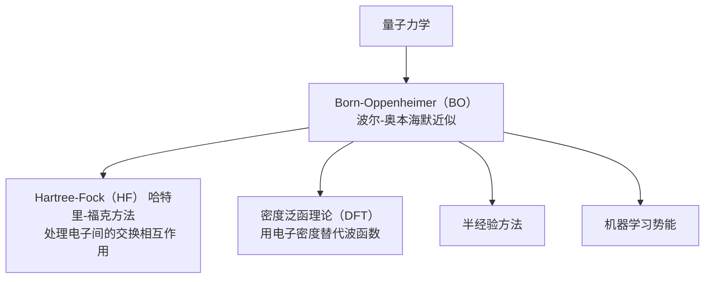

[[toc]]
# 流程

# 量子力学
## 完整薛定谔方程
$$
\hat{H}_{total}\psi(r, R) = E\psi(r, R)
$$

$$
\hat{H}_{total} = \hat{T}_e + \hat{T}_n + \hat{V}_{ee} + \hat{V}_{en} + \hat{V}_{nn}
$$

- $\hat{T}_e$：电子动能
- $\hat{T}_n$：核动能
- $\hat{V}_{ee}$：电子-电子排斥
- $\hat{V}_{en}$：电子-核吸引
- $\hat{V}_{nn}$：核-核排斥
## OB
1. 原子核与电子的运动解耦处理
$$\hat{H}_{total}\psi(r, R) = E\psi(r, R)$$
波函数做以下近似
$$\psi(r, R) \approx \phi(r,R)\chi(R)$$
- $\phi(r,R)$:电子波函数
- $\chi(R)$:核波函数
- $r$：电子坐标
- $R$：核坐标
2. 固定原子核坐标，求解电子方程
$$
\hat{H}_{elec}\phi_{elec}(r,R) = E_{elec}(R)\phi_{elec}(r,R)
$$
3. 核运动势能面
## 波函数理论（Wave Function Theory）
### Hartree-Fock
### 后Hartree-Fock方法
## 密度泛函理论（Density Function Theory）

Jacob's Ladder雅各布天梯

## 计算方法
### 基组
#### 高斯型基组
#### 平面波
#### 数值原子轨道