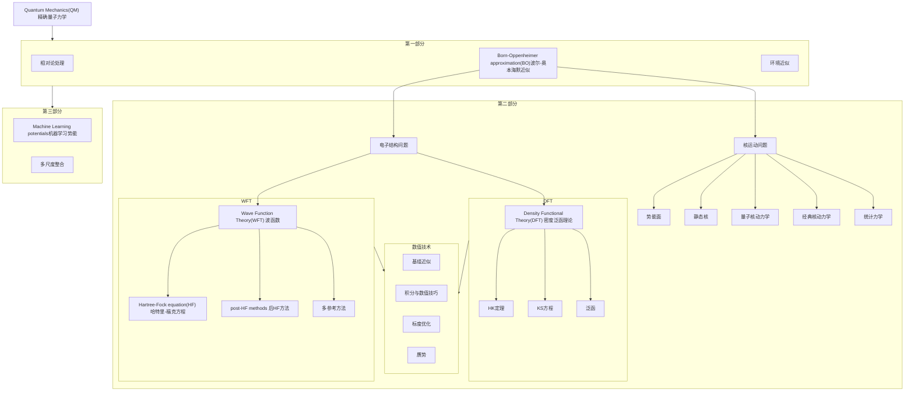

[[toc]]
# 流程

# 量子力学
## 完整薛定谔方程

:::important
化学要解释的几乎一切现象——化学键的形成与断裂、反应活性、光谱、磁性、催化——本质上都是电子在原子核势场中的运动问题，即多体薛定谔方程的求解问题。
此方程及其精确，只需要提供原子种类和个数就能得到分子的所有信息，但对多电子体系而言，电子间相互作用力难以描述，几乎精确无误的求解是不可能的。
:::
### 薛定谔方程
$$
\hat{H}_{total}\psi(r, R) = E\psi(r, R) \quad \text{(薛定谔方程)}
$$

### 哈密顿算符
$$
\hat{H}_{total} = \hat{T}_e + \hat{T}_n + \hat{V}_{ee} + \hat{V}_{en} + \hat{V}_{nn}
$$

| 符号 | 含义 |
|:---:|:---:|
| $\hat{T}_e$ | 电子动能 |
| $\hat{T}_n$ | 核动能 |
| $\hat{V}_{ee}$ | 电子-电子排斥 |
| $\hat{V}_{en}$ | 电子-核吸引 |
| $\hat{V}_{nn}$ | 核-核排斥 |

#### 波函数
一个分子 = N 个电子 + M 个原子核，共3(N+M) 个空间变量 + N 个电子自旋变量。
$$
\Phi = \Phi(r_1, r_2, \ldots, r_N; R_1, R_2, \ldots, R_M; t) \quad \text{（电子波函数）}
i\hbar \frac{\partial \Phi}{\partial t} = \hat{H}_{total}\Phi \quad \text{（含时薛定谔方程）}
\hat{H} \Psi_k = E_k \Psi_k \quad (k = 0, 1, 2, \ldots) \quad \text{（定态薛定谔方程）}
$$

:::important
含时波函数描述体系随时间的演化，而定态波函数描述能量本征态（即稳定状态）。
:::

### Born-Oppenheimer approximation
：：：important
核子质量是电子质量的1836倍，且核运动远远慢于电子，因此将原子核和电子分开计算。
:::
1. 原子核与电子的运动解耦处理
$$\hat{H}_{total}\psi(r, R) = E\psi(r, R)$$
波函数做以下近似
$$\psi(r, R) \approx \phi(r,R)\chi(R)$$
- $\phi(r,R)$:电子波函数
- $\chi(R)$:核波函数
- $r$：电子坐标
- $R$：核坐标
2. 固定原子核坐标，求解电子方程
$$
\hat{H}_{elec}\phi_{elec}(r,R) = E_{elec}(R)\phi_{elec}(r,R)
$$
3. 核运动势能面

#### 电子结构问题
1. WFT
- Hartree-Fock equation(HF) 哈特里-福克方程
- post-HF methods 后HF方法
- 多参考方法
2. DFT
- Hohenberg-Kohn 定理
- Kohn-Sham 方程
- 泛函

#### 核运动问题
### 相对论处理
:::important
将薛定谔方程中的非相对论动能项改成相对论动能项
对重元素（Z 大，内层电子速度接近光速），正确写法是狄拉克方程（四分量旋量波函数）或标量相对论有效哈密顿量（DKH、ZORA）。
轻元素（H、C、N、O……）相对论效应微小（
:::

### 环境近似
:::important
薛定谔方程描述的是真空中的孤立分子，真实环境中有溶剂，晶格等，环境近似的方式是在哈密顿量中增加势项描述环境的影响。
:::
- 隐式溶剂
- 周期边界
- QM/MM 介入

