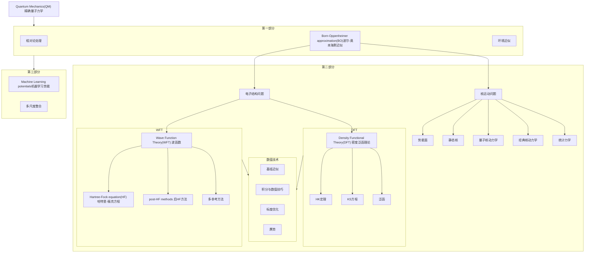

[[toc]]
# 流程

```mermaid
flowchart TD
    A["Quantum Mechanics(QM) 精确量子力学"]
subgraph 第一部分
    B[相对论处理]
    C["Born-Oppenheimer approximation(BO)波尔-奥本海默近似"]
    D[环境近似]
end
subgraph 第二部分
    C1[电子结构问题]
    subgraph WFT
    C11["Wave Function Theory(WFT) 波函数"]
    C111["Hartree-Fock equation(HF) 哈特里-福克方程"]
    C112[post-HF methods 后HF方法]
    C113[多参考方法]
    end
    subgraph DFT
    C12["Density Functional Theory(DFT) 密度泛函理论"]
    C121[HK定理]
    C122[KS方程]
    C123[泛函]
    end
subgraph 数值技术
    D1[基组近似]
    D2[积分与数值技巧]
    D3[标度优化]
    D4[赝势]
end


    C2[核运动问题]
    C21[势能面]
    C22[静态核]
    C23[量子核动力学]
    C24[经典核动力学]
    C25[统计力学]
end

subgraph 第三部分
    E[Machine Learning potentials机器学习势能]
    F[多尺度整合]
end

    A --> 第一部分
    C --> C1 & C2
    C1 --> C11 & C12
    C11 --> C111 & C112 & C113
    C12 --> C121 & C122 & C123
    C2 --> C21 & C22 & C23 & C24 & C25
    
    WFT & DFT --> 数值技术
    第一部分 --> 第三部分
    
```

# 量子力学
## 完整薛定谔方程

:::important
化学要解释的几乎一切现象——化学键的形成与断裂、反应活性、光谱、磁性、催化——本质上都是电子在原子核势场中的运动问题，即多体薛定谔方程的求解问题。
此方程及其精确，只需要提供原子种类和个数就能得到分子的所有信息，但对多电子体系而言，电子间相互作用力难以描述，几乎精确无误的求解是不可能的。
:::
### 薛定谔方程
$$
\hat{H}_{total}\psi(r, R) = E\psi(r, R) \quad \text{(薛定谔方程)}
$$


### 哈密顿算符
$$
\hat{H}_{total} = \hat{T}_e + \hat{T}_n + \hat{V}_{ee} + \hat{V}_{en} + \hat{V}_{nn}
$$


| 符号 | 含义 |
|:---:|:---:|
| $\hat{T}_e$ | 电子动能 |
| $\hat{T}_n$ | 核动能 |
| $\hat{V}_{ee}$ | 电子-电子排斥 |
| $\hat{V}_{en}$ | 电子-核吸引 |
| $\hat{V}_{nn}$ | 核-核排斥 |


#### 波函数
一个分子 = N 个电子 + M 个原子核，共3(N+M) 个空间变量 + N 个电子自旋变量。
$$
\Phi = \Phi(r_1, r_2, \ldots, r_N; R_1, R_2, \ldots, R_M; t) \quad \text{（电子波函数）}
i\hbar \frac{\partial \Phi}{\partial t} = \hat{H}_{total}\Phi \quad \text{（含时薛定谔方程）}
\hat{H} \Psi_k = E_k \Psi_k \quad (k = 0, 1, 2, \ldots) \quad \text{（定态薛定谔方程）}
$$

:::important
含时波函数描述体系随时间的演化，而定态波函数描述能量本征态（即稳定状态）。
:::


### Born-Oppenheimer approximation
：：：important
核子质量是电子质量的1836倍，且核运动远远慢于电子，因此将原子核和电子分开计算。
:::
1. 原子核与电子的运动解耦处理
$$\hat{H}_{total}\psi(r, R) = E\psi(r, R)$$
波函数做以下近似
$$\psi(r, R) \approx \phi(r,R)\chi(R)$$
- $\phi(r,R)$:电子波函数
- $\chi(R)$:核波函数
- $r$：电子坐标
- $R$：核坐标
2. 固定原子核坐标，求解电子方程
$$
\hat{H}_{elec}\phi_{elec}(r,R) = E_{elec}(R)\phi_{elec}(r,R)
$$
3. 核运动势能面

#### 电子结构问题
1. WFT
- Hartree-Fock equation(HF) 哈特里-福克方程
- post-HF methods 后HF方法
- 多参考方法
2. DFT
- Hohenberg-Kohn 定理
- Kohn-Sham 方程
- 泛函

#### 核运动问题
### 相对论处理
:::important
将薛定谔方程中的非相对论动能项改成相对论动能项
对重元素（Z 大，内层电子速度接近光速），正确写法是狄拉克方程（四分量旋量波函数）或标量相对论有效哈密顿量（DKH、ZORA）。
轻元素（H、C、N、O……）相对论效应微小（
:::

### 环境近似
:::important
薛定谔方程描述的是真空中的孤立分子，真实环境中有溶剂，晶格等，环境近似的方式是在哈密顿量中增加势项描述环境的影响。
:::
- 隐式溶剂
- 周期边界
- QM/MM 介入


---

## 近似求解方法

薛定谔方程对多电子体系几乎无法精确求解。以下三类方法是计算化学的理论基础。

### 3.1 非简并态微扰论（Rayleigh-Schrödinger Perturbation Theory）

**核心思路**：把哈密顿量拆成"可精确求解的部分"加"小扰动"：

$$
\hat{H} = \hat{H}_0 + \lambda\hat{H}', \quad \lambda \ll 1
$$

其中 $\hat{H}_0$ 的本征值 $E_n^{(0)}$ 和本征态 $\psi_n^{(0)}$ 已知，$\hat{H}'$ 是微小修正。

将能量和波函数按 $\lambda$ 展开：

$$
E_n = E_n^{(0)} + \lambda E_n^{(1)} + \lambda^2 E_n^{(2)} + \cdots
$$

$$
\psi_n = \psi_n^{(0)} + \lambda\psi_n^{(1)} + \lambda^2\psi_n^{(2)} + \cdots
$$

代入薛定谔方程，按 $\lambda$ 的幂次分离，逐阶求解：

**一阶能量修正**（最常用）：

$$
\boxed{E_n^{(1)} = \langle\psi_n^{(0)}|\hat{H}'|\psi_n^{(0)}\rangle}
$$

物理意义：扰动哈密顿量在未微扰态下的期望值。

**二阶能量修正**：

$$
E_n^{(2)} = \sum_{m \neq n} \frac{|\langle\psi_m^{(0)}|\hat{H}'|\psi_n^{(0)}\rangle|^2}{E_n^{(0)} - E_m^{(0)}}
$$

:::tip
分母 $E_n^{(0)} - E_m^{(0)}$ 不能为零——这正是"非简并"的要求。若存在简并，需用 3.2 的方法处理。
:::

**典型应用**：
- 氦原子：电子-电子排斥 $\frac{e^2}{r_{12}}$ 作为扰动
- Stark 效应：氢原子在弱电场中的能级分裂
- MP2（二阶 Møller-Plesset 微扰）：后 HF 方法的基础

---

### 3.2 简并态微扰论

**问题**：若 $E_n^{(0)} = E_m^{(0)}$（简并），二阶修正的分母为零，展开发散。

**解决方案**：在简并子空间内，先将 $\hat{H}'$ 对角化，找到"好的零阶基"：

1. 设简并度为 $g$，在 $g$ 维简并子空间中构造 $\hat{H}'$ 的矩阵：
   $$
   H'_{ij} = \langle\psi_i^{(0)}|\hat{H}'|\psi_j^{(0)}\rangle, \quad i,j = 1,\ldots,g
   $$

2. 对角化此 $g\times g$ 矩阵，本征值即为一阶能量修正 $E^{(1)}$：
   $$
   \det(H' - E^{(1)}I) = 0
   $$

3. 对应的本征向量给出"好基"——在好基下简并消除，可继续做高阶微扰。

**典型应用**：
- 氢原子 $n=2$ 层（$2s, 2p_x, 2p_y, 2p_z$ 四重简并）加电场 → Stark 效应精确处理
- 晶体场理论：配位场对 $d$ 轨道简并的消除

---

### 3.3 变分法（Variational Method）

**核心定理（变分原理）**：对于任意归一化的试探波函数 $|\tilde{\psi}\rangle$，其能量期望值永远不低于真实基态能量：

$$
\boxed{E[\tilde{\psi}] = \frac{\langle\tilde{\psi}|\hat{H}|\tilde{\psi}\rangle}{\langle\tilde{\psi}|\tilde{\psi}\rangle} \geq E_0}
$$

等号成立当且仅当 $|\tilde{\psi}\rangle$ 恰好是基态波函数。

**使用方式**：
1. 选定含参数 $\{\alpha_i\}$ 的试探函数 $\tilde{\psi}(\mathbf{r}; \alpha_1, \alpha_2, \ldots)$
2. 计算能量泛函 $E(\alpha_1, \alpha_2, \ldots) = \langle\tilde{\psi}|\hat{H}|\tilde{\psi}\rangle$
3. 对参数求极小值：$\dfrac{\partial E}{\partial \alpha_i} = 0$
4. 极小值就是基态能量的**上界估计**，对应的 $\tilde{\psi}$ 是基态波函数的**最佳近似**

**变分法的重要性**——这是整个计算化学的核心工具：

| 方法 | 试探波函数的形式 |
|:---|:---|
| Hartree-Fock（HF）| 斯莱特行列式（单 Slater determinant）|
| 组态相互作用（CI）| 多个斯莱特行列式的线性组合 |
| DFT（Kohn-Sham）| 等价变分问题（对电子密度泛函变分）|

:::important
**变分法是 WFT 和 DFT 的共同数学基础。** HF 方程的推导就是对斯莱特行列式做变分，Kohn-Sham 方程的推导则是对电子密度做泛函变分。两条路线殊途同归。
:::

---

### 3.4 含时微扰论与费米黄金规则

当体系受到**时变扰动**（如光照、脉冲电场）时，需要分析量子态如何随时间在不同能级间演化。

**设置**：$\hat{H}(t) = \hat{H}_0 + \hat{H}'(t)$，其中 $\hat{H}'(t)$ 在 $t=0$ 时刻突然开启。

将含时态展开为 $\hat{H}_0$ 本征态的叠加：

$$
|\Psi(t)\rangle = \sum_n c_n(t) e^{-iE_n t/\hbar} |n\rangle
$$

代入含时薛定谔方程，一阶微扰给出跃迁振幅：

$$
c_f^{(1)}(t) = \frac{1}{i\hbar}\int_0^t \langle f|\hat{H}'(t')|i\rangle e^{i\omega_{fi}t'} dt'
$$

其中 $\omega_{fi} = (E_f - E_i)/\hbar$ 为跃迁频率。

对于**周期性扰动** $\hat{H}'(t) = \hat{V}e^{-i\omega t} + \text{h.c.}$（如单色光），在长时极限下跃迁概率正比于：

$$
P_{i\to f}(t) \propto |\langle f|\hat{V}|i\rangle|^2 \cdot t \cdot \delta(E_f - E_i - \hbar\omega)
$$

单位时间跃迁概率即**费米黄金规则（Fermi's Golden Rule）**：

$$
\boxed{\Gamma_{i\to f} = \frac{2\pi}{\hbar}|\langle f|\hat{H}'|i\rangle|^2\,\rho(E_f)}
$$

其中 $\rho(E_f)$ 是末态的**态密度**。

**物理意义**：跃迁速率正比于"矩阵元的平方"乘以"末态密度"。若矩阵元为零，跃迁**禁戒**——这就是光谱选择定则的来源。

**典型应用**：
- 光谱选择定则（$\Delta l = \pm 1$，$\Delta m_l = 0, \pm 1$ 等）
- 辐射寿命计算
- TD-DFT（含时密度泛函理论）的物理基础

---

## WFT 路线：波函数理论

> **核心思想**：直接求解多电子波函数 $\Psi(r_1, r_2, \ldots, r_N)$，从波函数中提取所有物理信息。

### Hartree-Fock 方程（HF）

**出发点**：用单个斯莱特行列式近似多电子波函数（对变分法的应用）：

$$
\Psi_{HF} = \frac{1}{\sqrt{N!}}
\begin{vmatrix}
\chi_1(\mathbf{x}_1) & \chi_2(\mathbf{x}_1) & \cdots & \chi_N(\mathbf{x}_1) \\
\chi_1(\mathbf{x}_2) & \chi_2(\mathbf{x}_2) & \cdots & \chi_N(\mathbf{x}_2) \\
\vdots & & \ddots & \vdots \\
\chi_1(\mathbf{x}_N) & \cdots & & \chi_N(\mathbf{x}_N)
\end{vmatrix}
$$

对 $\Psi_{HF}$ 的能量泛函做变分（$\delta E = 0$），导出每个轨道满足的**HF 方程**：

$$
\hat{f}\,\chi_i = \varepsilon_i\,\chi_i
$$

其中 Fock 算符 $\hat{f}$ 为：

$$
\hat{f}(\mathbf{x}_1) = \hat{h}(\mathbf{x}_1) + \sum_{j} \left[\hat{J}_j(\mathbf{x}_1) - \hat{K}_j(\mathbf{x}_1)\right]
$$

| 项 | 名称 | 物理意义 |
|:---:|:---:|:---|
| $\hat{h}$ | 单电子算符 | 动能 + 核吸引势 |
| $\hat{J}_j$ | Coulomb 算符 | 电子 $j$ 产生的平均静电排斥 |
| $\hat{K}_j$ | Exchange 算符 | 交换作用（纯量子效应，无经典对应）|

**HF 的局限——相关能**：HF 用平均场代替真实的瞬时电子-电子排斥，因此忽略了**电子相关（electron correlation）**：

$$
E_{corr} = E_{exact} - E_{HF} < 0
$$

对于化学键的断裂、过渡态等，相关能不可忽略。

### post-HF 方法

在 HF 基础上，系统地引入多组态（多个斯莱特行列式）以恢复电子相关：

| 方法 | 全称 | 原理 | 计算量 |
|:---|:---:|:---|:---:|
| MP2 | Møller-Plesset 2阶 | 微扰论（3.1）恢复相关 | $O(N^5)$ |
| CCSD | 耦合簇 SD | 指数拟设（精确到双激发）| $O(N^6)$ |
| CCSD(T) | 耦合簇 SD(T) | 含微扰三激发修正 | $O(N^7)$ |
| CASSCF | 完全活化空间 SCF | 多参考，处理强相关 | 指数级 |
| FCI | 全组态相互作用 | 精确解（计算上不可行）| 指数级 |

:::tip
**"黄金标准"**：CCSD(T) 被称为量子化学的黄金标准，精度极高，常用于小分子的热化学数据。
:::

---

## DFT 路线：密度泛函理论

> **核心思想**：抛弃 $3N$ 维波函数，转而以三维电子密度 $\rho(\mathbf{r})$ 为基本变量。

### Hohenberg-Kohn 定理（HK 定理，1964）

**定理一（唯一性）**：体系的基态外势 $v_{ext}(\mathbf{r})$（即核势）由基态电子密度 $\rho_0(\mathbf{r})$ **唯一确定**。

**定理二（变分原理）**：基态能量是电子密度的泛函 $E[\rho]$，且对任意试探密度 $\tilde{\rho}$：

$$
E[\tilde{\rho}] \geq E_0 = E[\rho_0]
$$

**意义**：基态的所有物理性质都被基态密度 $\rho_0(\mathbf{r})$ 完全决定。理论上只需3个空间变量，而非 $3N$ 个。

**困难**：泛函 $E[\rho]$ 的精确形式未知，尤其是动能泛函 $T[\rho]$。

### Kohn-Sham 方程（KS 方程，1965）

**解决方案**：引入一个辅助的无相互作用参考体系，其轨道（KS 轨道）给出与真实体系相同的密度。

对总能量泛函做变分，导出一组类 HF 的单粒子方程——**Kohn-Sham 方程**：

$$
\left[-\frac{\hbar^2}{2m_e}\nabla^2 + v_{eff}(\mathbf{r})\right]\phi_i(\mathbf{r}) = \varepsilon_i\phi_i(\mathbf{r})
$$

有效势 $v_{eff}$ 包含三项：

$$
v_{eff}(\mathbf{r}) = \underbrace{v_{ext}(\mathbf{r})}_{\text{核势}} + \underbrace{\int\frac{\rho(\mathbf{r}')}{|\mathbf{r}-\mathbf{r}'|}d\mathbf{r}'}_{\text{Hartree 势（经典库仑）}} + \underbrace{v_{xc}(\mathbf{r})}_{\text{交换相关势}}
$$

电子密度由 KS 轨道构造：

$$
\rho(\mathbf{r}) = \sum_{i=1}^{N}|\phi_i(\mathbf{r})|^2
$$

**自洽场（SCF）循环**：

```
初猜密度 ρ₀
    ↓
构造 v_eff[ρ]
    ↓
求解 KS 方程 → 新轨道 φᵢ
    ↓
更新密度 ρ = Σ|φᵢ|²
    ↓
收敛？ → 否：返回上一步
    ↓  是
输出能量、密度、性质
```

### 交换相关泛函（$E_{xc}$）

KS 方程唯一的未知量是**交换相关泛函** $E_{xc}[\rho]$，它包含了所有量子多体效应。

**泛函近似的"雅各布天梯"**（从低精度到高精度）：

| 级别 | 名称 | 代表泛函 | 特点 |
|:---:|:---:|:---:|:---|
| 1 | LDA | SVWN | 只用局域密度，精度低 |
| 2 | GGA | PBE, BLYP | 引入密度梯度 $\nabla\rho$ |
| 3 | meta-GGA | TPSS, r²SCAN | 再引入动能密度 $\tau$ |
| 4 | 杂化泛函 | B3LYP, PBE0 | 混入部分精确 HF 交换 |
| 5 | 双杂化 | B2-PLYP | 再加 MP2 相关 |
| ∞ | 精确泛函 | 未知 | 理论上存在，实践中未找到 |

:::tip
**B3LYP** 是有机化学中最常用的泛函；**PBE** 是固体物理和材料科学的标准选择；**ωB97X-D** 等范德华修正泛函用于弱相互作用体系。
:::

### DFT vs WFT

| 对比项 | WFT（HF/CCSD(T)）| DFT（KS-DFT）|
|:---|:---:|:---:|
| 基本变量 | 波函数 $\Psi(r_1,\ldots,r_N)$ | 电子密度 $\rho(\mathbf{r})$ |
| 计算量 | $O(N^3) \sim O(N^7)$ | $O(N^3)$ |
| 系统改进 | 可沿 CC 级别提升精度 | 泛函选择缺乏系统性 |
| 弱相互作用 | 精确（需要高级方法）| 需色散修正（DFT-D3）|
| 强相关体系 | CASSCF 可处理 | 普通泛函失效 |
| 适用体系规模 | 小分子（\<100原子）| 大体系（\>1000原子）|


---

:::important
**本笔记的理论基础**：薛定谔方程的推导过程、希尔伯特空间数学结构、氢原子精确求解与电子自旋，见配套笔记 [薛定谔方程的由来.md](./薛定谔方程的由来.md)。
:::
